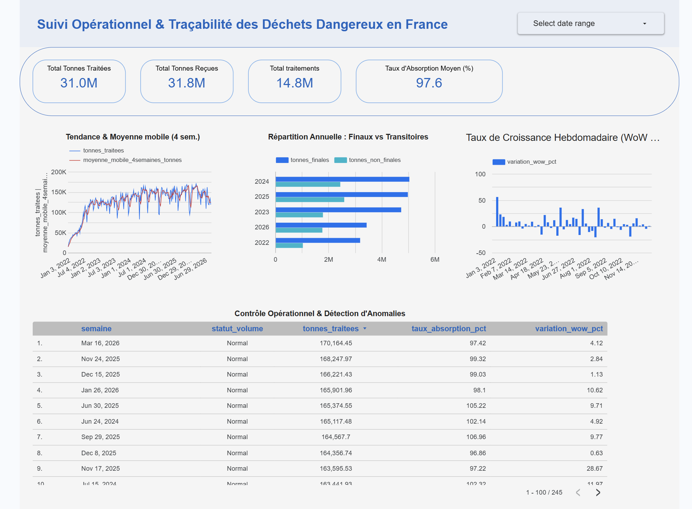

# ♻️ Suivi Opérationnel & Traçabilité des Déchets Dangereux en France

> Tableau de bord décisionnel et pipeline analytique cloud basés sur les données ouvertes du registre d'État **Trackdéchets** (Ministère de la Transition Écologique).



🔗 **Lien du rapport interactif :** https://datastudio.google.com/reporting/7e4dee8f-a135-49b7-b76b-3a758062bc8f
---

## 🎯 Contexte & Objectifs Métier
En France, la traçabilité des déchets industriels dangereux s'opère via les Bordereaux de Suivi de Déchets Dangereux (BSDD). Ce projet modélise les données nationales consolidées pour :
- **Suivre les volumes industriels globaux** : centralisation hebdomadaire des tonnages reçus et traités (+31 millions de tonnes cumulées).
- **Mesurer la capacité d'absorption** : calcul de l'efficience opérationnelle ($tonnes\_traitees / tonnes\_recues$).
- **Analyser la structure de la filière** : ventilation entre opérations finales (valorisation ou élimination définitive) et non finales (transit, stockage, regroupement).
- **Détecter les déviations statistiques** : identification automatisée des semaines atypiques (pics et creux de volume).

---

## 🛠️ Stack Technique
- **Entrepôt Cloud :** Google Cloud BigQuery
- **SQL Analytique :** Fonctions de fenêtrage (`AVG OVER ROWS`, `LAG`, `STDDEV OVER`), ratios sécurisés (`SAFE_DIVIDE`), CTE et typage temporel.
- **Restitution & BI :** Google Looker Studio
- **Source de données :** [data.gouv.fr — Statistiques relatives aux déchets dangereux](https://www.data.gouv.fr/datasets/trackdechets-donnees-statistiques-relatives-aux-dechets-dangereux-en-france)

---

## 📊 Fonctionnalités du Tableau de Bord
- **Filtrage temporel dynamique (*Date Range Control*) :** sélecteur de période globale en en-tête permettant de recalibrer instantanément l'ensemble des KPIs et graphiques sur une plage de dates personnalisée (ex. zoom sur l'année 2024 ou un trimestre spécifique).
- **Cartes KPIs synthétiques :** vision consolidée des tonnages traités (31,0M), reçus (31,8M), du volume total de traitements (14,8M) et du taux d'absorption moyen (97,6 %).
- **Analyse de tendance lissée :** courbe d'évolution hebdomadaire combinée à une moyenne mobile sur 4 semaines pour isoler la tendance de fond des à-coups calendaires.
- **Croissance hebdomadaire (WoW %) :** visualisation des variations relatives d'une semaine sur l'autre (accélérations et ralentissements d'activité).
- **Répartition annuelle des filières :** comparaison volumétrique des traitements définitifs vs transitoires.
- **Tableau de contrôle opérationnel :** reporting granulaire par semaine avec tri dynamique et identification visuelle des anomalies de volume.

---

## 🗄️ Architecture Analytique (Vue BigQuery)
Le modèle de données repose sur une vue normalisée (`v_analytics_avancee` disponible dans `pipeline_analytics.sql`) exécutée dans BigQuery :

```sql
-- Extrait : lissage par moyenne mobile et détection d'anomalies à +/- 2 écarts-types
ROUND(AVG(quantite_traitee) OVER(
    ORDER BY semaine 
    ROWS BETWEEN 3 PRECEDING AND CURRENT ROW
), 2) AS moyenne_mobile_4semaines_tonnes,

ROUND(
    SAFE_DIVIDE(
        quantite_traitee - LAG(quantite_traitee, 1) OVER(ORDER BY semaine),
        LAG(quantite_traitee, 1) OVER(ORDER BY semaine)
    ) * 100, 
2) AS variation_wow_pct,

CASE 
    WHEN quantite_traitee > (AVG(quantite_traitee) OVER() + 2 * STDDEV(quantite_traitee) OVER()) THEN 'Pic anormal'
    WHEN quantite_traitee < (AVG(quantite_traitee) OVER() - 2 * STDDEV(quantite_traitee) OVER()) THEN 'Creux anormal'
    ELSE 'Normal'
END AS statut_volume